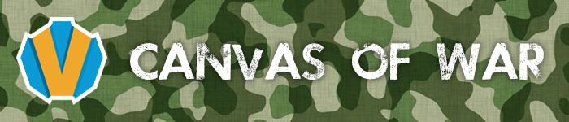

###About

Canvas of war is an online 2d multiplayer shooting game. The game is built using Box2d framework for javascript, HTML5, jQuery and js for rendering, Node.js for server, Socket.io for socket communication. The main aim of the game is to huntdown other players and kill them.

###Installation

If one just wants to explore without multiplayers, one has to open index.html file in one's browser. If one wants multiplayer functionality, one must follow these instructions

- Install Node.js
- create a new directory anywhere, copy the files provided into that directory
- run: npm install --save express@4.10.2
- run: npm install --save socket.io
- run: node index.js

###Usage

For no multiplayer and to just explore open index.html. For multiplayer do the following

- open a browser and go to http://server-ip:3000/
- Enter your name
- Invite your friends, ask them to do the same thing. Enter different names

###Controls: 
- Moving : up,down,left,right or w,a,s,d keys
- Shooting : spacebar or mouse click
- Aiming : Mouse
- Zooming : Left shift or button in the top right corner
- Reloading : r key (automatic reloading if ammo is deplenished)
- Mute music: click on the music button to toggle the background music
- Mute sound effects: click on the speaker button to toggle the sound effects
- Delete info : If you chose to save your info and now want to delete it, click on the trash button in the right-bottom corner

###Screenshot and demo

Will be updated soon
